# Executando via GUI (run_gui)

O `run_gui` é um executor visual que permite selecionar testes, configurar a execução e disparar o `pytest` sem montar comandos manualmente.

## Como abrir

- Windows: execute `run_gui.bat`
- Linux/macOS: execute `./run_gui.sh` (se necessário, `chmod +x run_gui.sh`)

Importante: o GUI espera que o projeto esteja com `.venv` criado e com dependências instaladas.

## Visão geral da tela

O GUI está organizado em duas áreas:

- Painel esquerdo: planos, filtro e lista de testes (seleção).
- Painel direito: configurações, execução, logs e histórico.

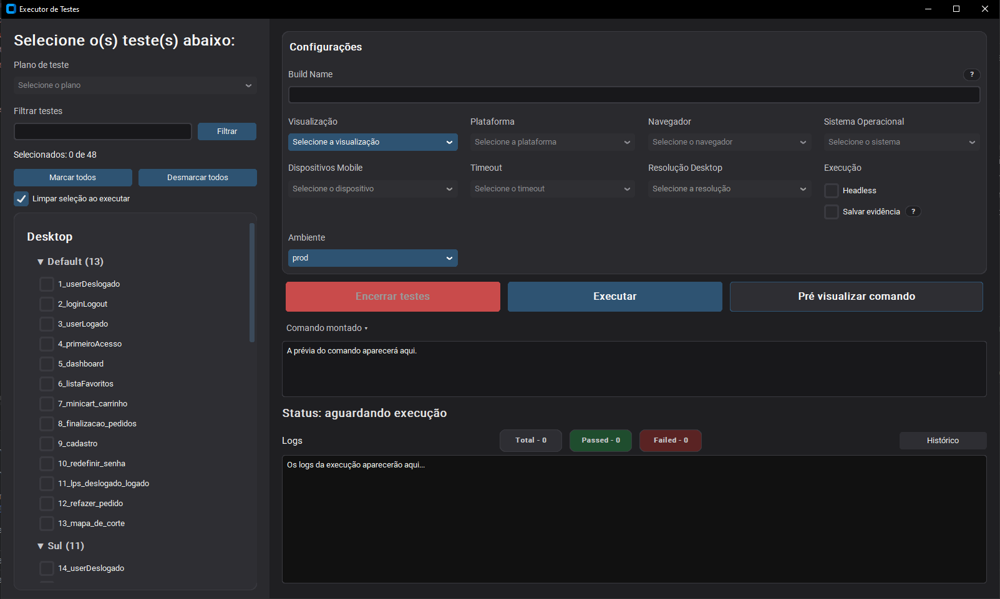

## 1) Plano e seleção de testes (painel esquerdo)

### Plano de teste

O campo **Plano de teste** seleciona um conjunto pronto (ex.: Smoke, Regressão) definido em `test_plans.json`.

- Use quando quiser rodar suítes padrão sem selecionar arquivo por arquivo.
- Se você mantiver o `test_plans.json` atualizado, o time reduz divergência de "o que é smoke/regressão" entre pessoas.

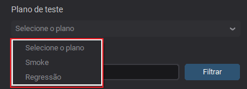

### Filtrar testes

O campo **Filtrar testes** reduz a lista exibida conforme o texto digitado.

- Exemplos de filtro: `mobile`, `checkout`, `carrinho`.
- O filtro não muda os testes existentes no projeto; ele só ajuda a encontrar e selecionar.

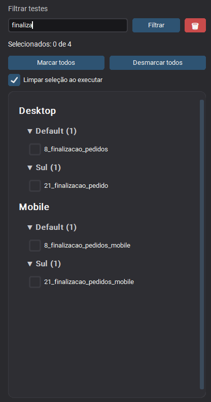

### Marcar todos / Desmarcar todos

Atalhos para selecionar rapidamente:

- **Marcar todos**: seleciona tudo o que está carregado na lista.
- **Desmarcar todos**: remove seleção.

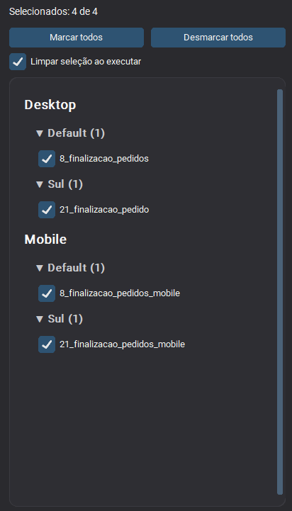

### Limpar seleção ao executar

Quando marcado, o GUI limpa os checkboxes após iniciar a execução. Isso evita rodar o mesmo "lote" por engano em execuções sequenciais.

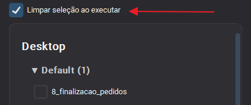

## 2) Configurações (painel direito)

### Build Name

Campo para dar nome à execução.

- Ajuda a agrupar execuções no histórico do GUI.
- Em grids remotos (Lambda Test, Browser Stack, Sauce Labs), geralmente aparece como nome de build/suite.
- Nomes sugeridos: `smoke-YYYY-MM-DD`, `regressao-sprint-10`, `DIG-1234`.

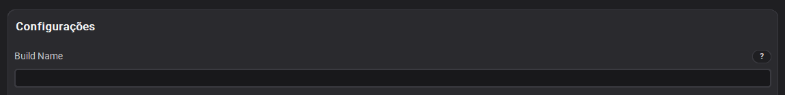

### Visualização

Define se a execução será **desktop** ou **mobile**.

- **Desktop**: o painel esquerdo passa a exibir apenas testes de desktop (normalmente em `Testes/`). A lista é recarregada (a seleção anterior não é mantida). Ao executar, o GUI adiciona `--ambiente desktop` no comando do `pytest`.
- **Mobile**: o painel esquerdo passa a exibir apenas testes mobile (normalmente em `Testes_Mobile/`). A lista é recarregada (a seleção anterior não é mantida). Ao executar, o GUI adiciona `--ambiente mobile` no comando do `pytest`.
- Dica: em mobile, os campos **Sistema Operacional** e **Dispositivo** deixam de ser opcionais na prática (o provider precisa dessas informações para alocar o device correto).

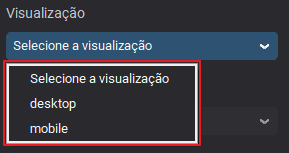

### Plataforma

Define onde a execução roda:

- `local`: roda na sua máquina.
- `lt`: LambdaTest (grid remoto).
- `bs`: BrowserStack (grid remoto).
- `sauce`: Sauce Labs (grid remoto).
- Observação: em grids remotos (`lt`, `bs`, `sauce`), é necessário configurar credenciais no `.env` (ver **Configuração e variáveis**).
- Observação: em `local`, o teste roda no seu navegador local (normalmente Chrome/Firefox).

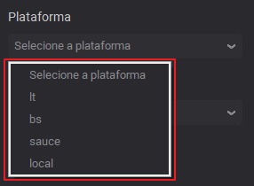

### Navegador

Escolhe o navegador:

- Desktop: `chrome`, `firefox`, `edge`, `safari` (dependendo da plataforma escolhida).
- Mobile: normalmente `safari` em iOS e `chrome` em Android.
- `local`: normalmente use `chrome` ou `firefox` (navegadores instalados na sua máquina).
- Providers (`lt`, `bs`, `sauce`): o navegador roda remoto (grid na nuvem). A disponibilidade de `edge/safari` depende do provider e do **Sistema Operacional** selecionado.

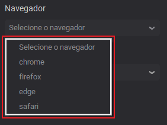

### Sistema Operacional

Define em qual sistema/plataforma o navegador (ou device) será provisionado.

- `local`: este campo tende a ter pouco ou nenhum efeito prático, porque o teste roda na sua máquina. O que manda é o navegador instalado localmente (ex.: Chrome/Firefox).
- Providers (`lt`, `bs`, `sauce`): este campo vira parte das "capabilities" do grid remoto, ou seja, define em qual sistema o provider vai abrir o navegador/device.

Regras práticas:

- Desktop: use algo como `Windows 11` quando estiver em provider (o grid vai abrir um Windows remoto com o navegador escolhido).
- Mobile: escolha `Android` ou `iOS` quando estiver em provider (isso define o tipo de device que será alocado e influencia o navegador).
  - `iOS`: normalmente combina com `safari` e um **Dispositivo** do tipo iPhone.
  - `Android`: normalmente combina com `chrome` e um **Dispositivo** do tipo Pixel/Samsung, etc.

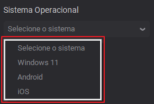

### Dispositivos Mobile

Escolhe o device (principalmente para execuções com **Visualização = Mobile**).

Regras do `run_gui` (habilitar/desabilitar):

- Quando **Visualização = Desktop**, este campo fica **desabilitado** (acinzentado). O GUI limpa o valor selecionado e oculta o campo de digitação de device custom.

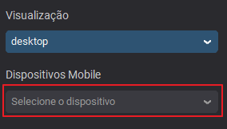

- Quando **Visualização = Mobile**, este campo fica **habilitado** e volta para o estado inicial (placeholder "Selecione o dispositivo"), para você selecionar um device.

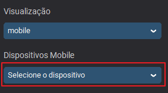

Como preencher:

- Selecione um device da lista quando possível (reduz erro de digitação; providers são sensíveis ao nome exato).

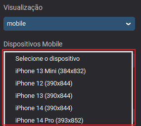

- Se escolher **Outro (digitar)**, o GUI exibe um campo para você digitar o nome do device manualmente.

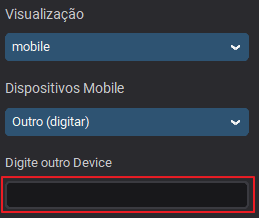

Impacto na execução:

- Quando um device válido é selecionado, o GUI adiciona `--device "<nome>"` no comando do `pytest`.

### Timeout

Define o timeout padrão (em segundos) usado nas esperas explícitas (waits) do projeto.

Como funciona (na prática):

- O GUI adiciona `--timeout <segundos>` ao comando do `pytest`.
- Esse valor vira o timeout padrão do `WebDriverWait` usado nas fixtures e em vários helpers (ex.: `visible`, `clickable`).
- Quando uma condição não é atendida (elemento não fica visível/clicável, etc.), o teste espera até esse tempo e então falha com timeout.

Impacto nos testes:

- Aumentar o timeout reduz falhas por lentidão momentânea, mas pode deixar a suíte mais lenta quando algo está realmente errado (cada wait pode demorar mais para estourar).
- Diminuir o timeout deixa a suíte mais “rápida para falhar”, mas pode aumentar flakiness em ambientes instáveis.
- O timeout não “acelera” páginas lentas; ele só define quanto tempo o teste vai aguardar antes de desistir.

Recomendação:

- Use para ajustar tolerância em ambientes mais lentos (ex.: Lambda Test, Browser Stack, etc...).
- Evite aumentar por padrão como “solução”: prefira corrigir sincronização usando os `helpers/` (ver **Padrões de Teste**) e locators mais estáveis.

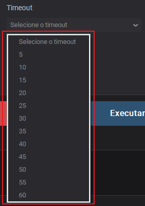

### Resolução Desktop

Escolhe a resolução no formato `LARGURAxALTURA` (ex.: `1920x1080`).

Regras do `run_gui` (habilitar/desabilitar):

- Quando **Visualização = Mobile**, este campo fica **desabilitado** (acinzentado). O GUI limpa o valor selecionado e oculta o campo de digitação de resolução custom.

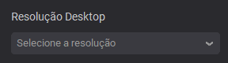

- Quando **Visualização = Desktop**, este campo fica **habilitado** e volta para o estado inicial (placeholder "Selecione a resolução"), para você escolher uma resolução.

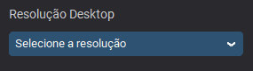

Como preencher:

- Selecione uma resolução da lista quando possível.

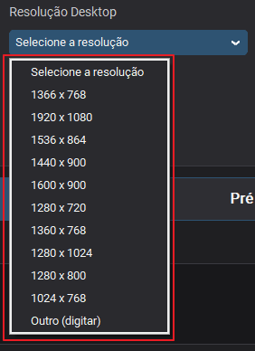

- Se escolher **Outro (digitar)**, o GUI exibe um campo para você digitar manualmente (ex.: `1440x900`).

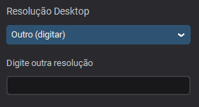

Impacto na execução:

- Quando uma resolução válida é selecionada, o GUI adiciona `--resolution LARGURAxALTURA` no comando do `pytest`.
- Em `local` + `headless`, isso impacta diretamente a viewport (pode alterar layout responsivo e pontos de quebra do site).
- Em providers (`lt`, `bs`, `sauce`), isso costuma virar configuração/capability de resolução remota do desktop.

### Ambiente e URL custom

O GUI permite escolher `prod|stg1|stg2|outro`. Essa seleção controla de onde vem a URL base do site.

De onde cada opção pega a URL (via `.env`):

- `prod`: usa `URL`
- `stg1`: usa `URL_STG1`.
- `stg2`: usa `URL_STG2`.

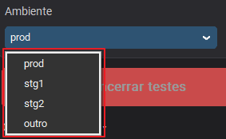

- `outro`: não depende das URLs do `.env` (você aponta manualmente).

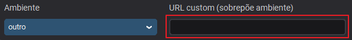

**URL custom (sobrescreve o ambiente)**: quando preenchida, o GUI passa essa URL para o pytest como `--base-url`, e ela tem prioridade sobre o `target-env` selecionado.

Regra importante:

- Se o ambiente for `outro`, o GUI exige que uma URL custom seja informada para permitir a execução.

## 3) Execução (painel direito)

### Headless

Quando marcado, executa sem interface gráfica.

- Recomendado para `--grid local`.
- Regra do GUI: se `Headless` estiver marcado e a plataforma não estiver definida, o GUI força `local` para evitar combinações inválidas.

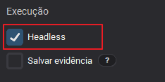

### Salvar evidência

Controla a captura de evidências adicionais durante a execução.

Como funciona:

- Quando marcado, o GUI adiciona `--record-screen` ao comando do `pytest`.
- Esse parâmetro ativa (ou força) a gravação de evidências conforme o tipo de execução (local vs provider).

Regras do `run_gui` (campo desabilitado):

- Se a **Plataforma** for um provider (`lt`, `bs`, `sauce`) e **Headless** estiver desmarcado, o GUI marca automaticamente **Salvar evidência** e desabilita o checkbox (fica travado ligado).

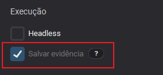

- Caso contrário (ex.: `local`, ou `headless` marcado), o checkbox fica habilitado e você decide se quer ligar ou não.

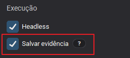

Impacto nos testes:

- Em providers, normalmente resulta em vídeo e/ou screenshots disponíveis no painel do provider para a sessão do Selenium.
- Em execução local, a evidência costuma ser gerada principalmente em caso de falha e salva em `evidencias_local/` (ou no caminho definido por `PYTEST_ARTIFACTS_ROOT`).

Recomendação:

- Deixe ligado quando estiver caçando falha intermitente (flaky) ou investigando erro no fluxo.
- Deixe desligado em execuções rápidas locais quando você só quer validar lógica/seletores e não precisa de arquivos extras.

### Pré-visualizar comando

Mostra o comando `pytest` montado pelo GUI com base na seleção e configurações, exatamente como ele será executado.

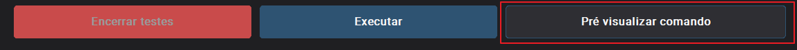

Use isso para diagnosticar:

- Quais testes (paths) foram incluídos no comando.
- Qual `--grid`/`--ambiente`/`--navegador`/`--so`/`--device`/`--timeout`/`--resolution`/`--target-env` o GUI vai usar.
- Se `--headless` e/ou `--record-screen` foram incluídos.
- Quantos workers (`-n`) foram configurados automaticamente (o GUI tenta paralelizar quando há mais de 1 teste selecionado).

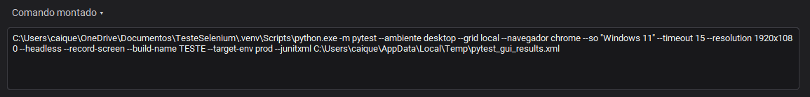

Quando isso ajuda mais:

- Se o botão **Executar** não roda como você esperava, use a pré-visualização para confirmar os parâmetros antes de iniciar.
- Para reproduzir via terminal (CLI), copie o comando montado e execute fora do GUI.

Observação: o GUI coloca aspas automaticamente em argumentos com espaço (ex.: `--device "iPhone 14"`), para o comando funcionar corretamente.

Comportamento de ocultação do campo:

- A área onde o comando aparece pode ser recolhida/expandida pelo botão **Comando montado** (seta para a direita quando recolhido, seta para baixo quando expandido).
- Recolher o campo não altera a execução; serve apenas para ganhar espaço na tela (por exemplo, para ver mais logs).

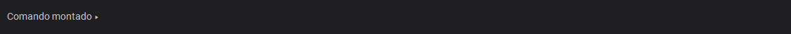

### Executar / Encerrar testes

**Executar** inicia uma execução do `pytest` com base no que está selecionado e configurado na tela.

O que acontece ao clicar em **Executar**:

- O GUI valida se existe pelo menos 1 teste selecionado (se não houver, ele avisa e não inicia).
- O GUI monta o comando (incluindo paths selecionados, flags e marcadores do plano) e mostra no campo **Comando montado**.
- O GUI limpa os logs, zera o resumo (Total/Passed/Failed) e inicia o `pytest` como um processo separado.
- O GUI gera um `--junitxml` temporário para conseguir montar o resumo e detalhar falhas no final.
- O GUI define `PYTEST_ARTIFACTS_ROOT` para apontar para `evidencias_local/` durante a execução (evidências locais).
- Se o checkbox **Limpar seleção ao executar** estiver marcado, o GUI desmarca a seleção após iniciar (e também reforça a limpeza ao final da execução).

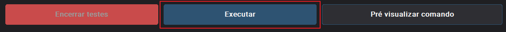

**Encerrar testes** tenta interromper a execução atual do `pytest` (o processo que o GUI abriu).

Como funciona o encerramento (resumo do comportamento):

- Windows: tenta primeiro `CTRL_BREAK_EVENT` (interrupção estilo console). Se não parar, tenta `terminate()`. Se ainda assim não parar, executa `taskkill /T /F` para encerrar a árvore de processos.
- Linux/macOS: tenta `terminate()` e, se necessário, `kill()`.

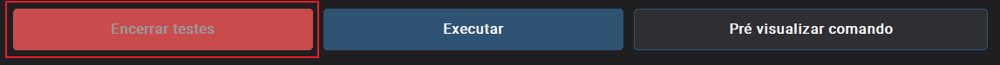

Observações importantes:

- O encerramento pode levar alguns segundos e nem sempre produz um "resultado limpo" (parte dos testes pode ficar como incompleto).
- Após encerrar, verifique o resumo e os logs para entender até onde a execução foi.

Os logs são exibidos na área **Logs**.

### Resumo (Total / Passed / Failed)

Ao final da execução, o GUI atualiza os blocos de resumo:

- **Total**: quantidade total de testes considerados no resultado (pass + fail).
- **Passed**: quantidade de testes que passaram.
- **Failed**: quantidade de testes que falharam.

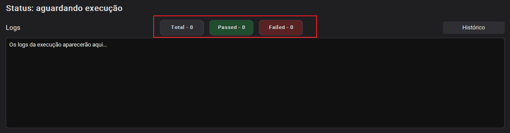

Como interpretar:

- Esses números vêm do resultado do `pytest` (o GUI também usa um `--junitxml` temporário para consolidar lista de testes e falhas).
- Se você interromper a execução, os números podem não refletir 100% do que foi selecionado (porque parte dos testes pode não ter chegado a finalizar).

Atalho útil:

- Os blocos são clicáveis. Ao clicar em **Total**, **Passed** ou **Failed**, o GUI abre uma janela com a lista de testes daquele grupo, para facilitar diagnóstico.

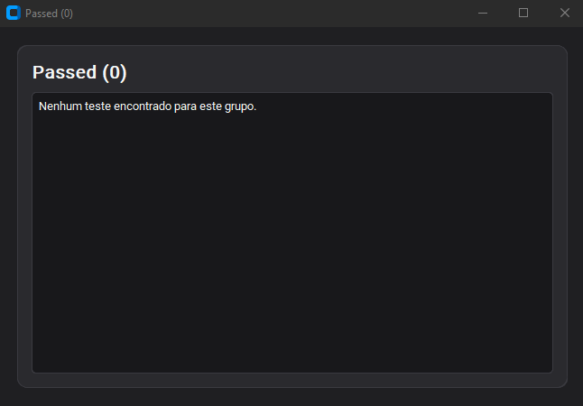

## 4) Histórico

O **Histórico** registra cada execução disparada pelo GUI e serve para comparação e diagnóstico, principalmente quando há flakiness.

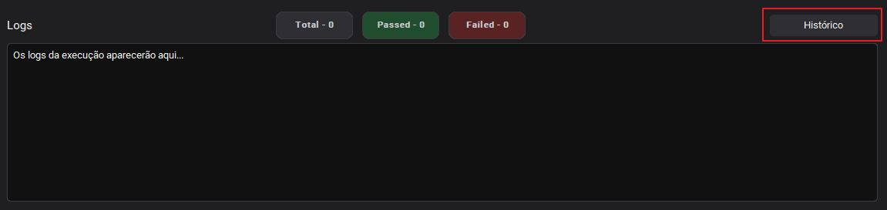

O que é salvo em cada execução (resumo):

- Data/hora e status (passed/failed).
- Totais (T/P/F) e contexto da execução: plataforma, visualização, navegador, SO, ambiente (`prod/stg1/stg2/outro`), headless, device ou resolução (conforme desktop/mobile).
- Nome da Build.
- Lista de testes selecionados.

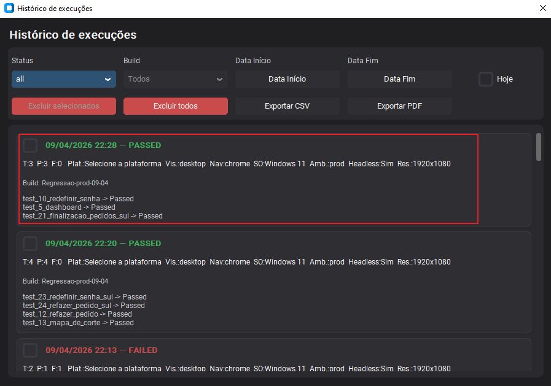

Onde fica armazenado:

- O histórico é persistido no arquivo `.test_history.json` na raiz do projeto (o GUI mantém um limite de entradas).

### Filtros e ações

No topo da janela de histórico você encontra:

- **Status**: filtra por `all`, `passed` ou `failed`.

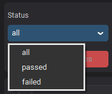

- **Build**: filtra pelo Build Name (ou **Todos**).

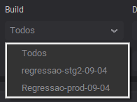

- **Data Início / Data Fim**: filtra por período (o calendário permite selecionar datas).

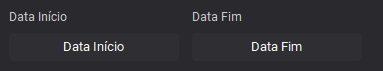

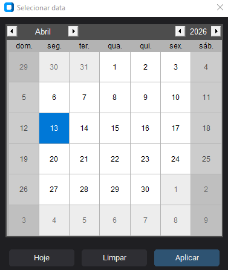

- **Hoje**: aplica um filtro rápido para o dia atual.

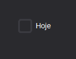

- **Exportar CSV**: exporta os itens filtrados com colunas (status, totais, grid, ambiente, device/resolução, headless, lista de testes e comando).
- **Exportar PDF**: exporta um resumo em PDF dos itens filtrados.

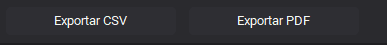

- **Excluir selecionados / Excluir todos**: remove entradas do histórico (com confirmação).

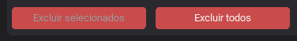

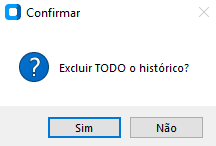

### Diagnóstico de falha: botão "ver log"

Quando uma execução tem falhas, o histórico lista os testes com status **Failed**. Para alguns testes com falha, aparece o botão **ver log** ao lado do nome.

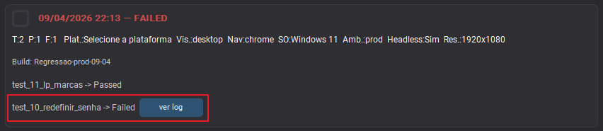

Como o "ver log" funciona:

- Ele abre um trecho do log da falha daquele teste, extraído do arquivo `--junitxml` gerado na execução.
- Esse trecho é um recorte (não é o log completo): normalmente contém a mensagem/stacktrace mais relevante e é limitado a um número máximo de linhas (para caber na tela).

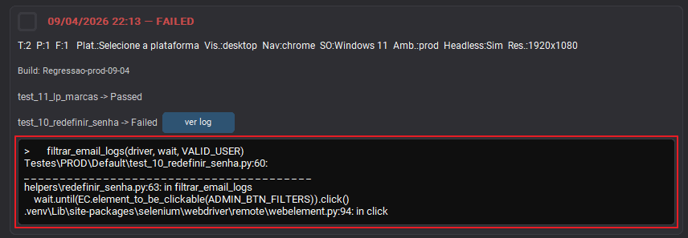

O que esse log é (e o que não é):

- Ele costuma mostrar a causa da falha no Python/Pytest (asserção, exceção e parte do traceback).
- Ele não substitui logs completos da execução nem evidências do provider (vídeo/screenshot) e não representa logs de console do navegador/rede.

Quando o "ver log" pode não aparecer:

- Nem toda falha gera um bloco de texto útil no `junitxml` (ou o trecho pode ficar vazio). Nesse caso, o histórico mostra o teste como Failed, mas não exibe o botão.

Para investigação completa:

- Use a área **Logs** da execução (na tela principal) e/ou as evidências do provider (vídeo/screenshot) quando estiver em `lt/bs/sauce`.

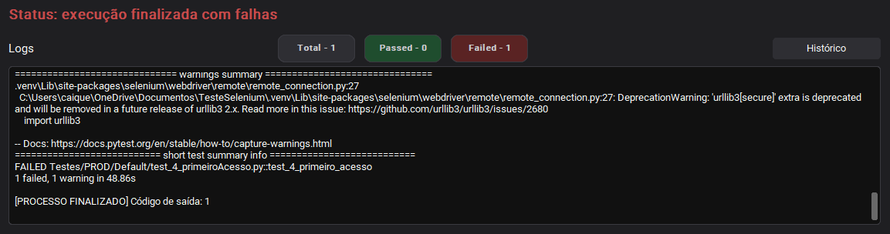
